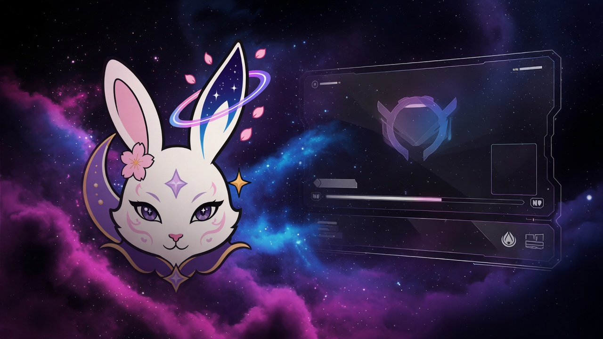
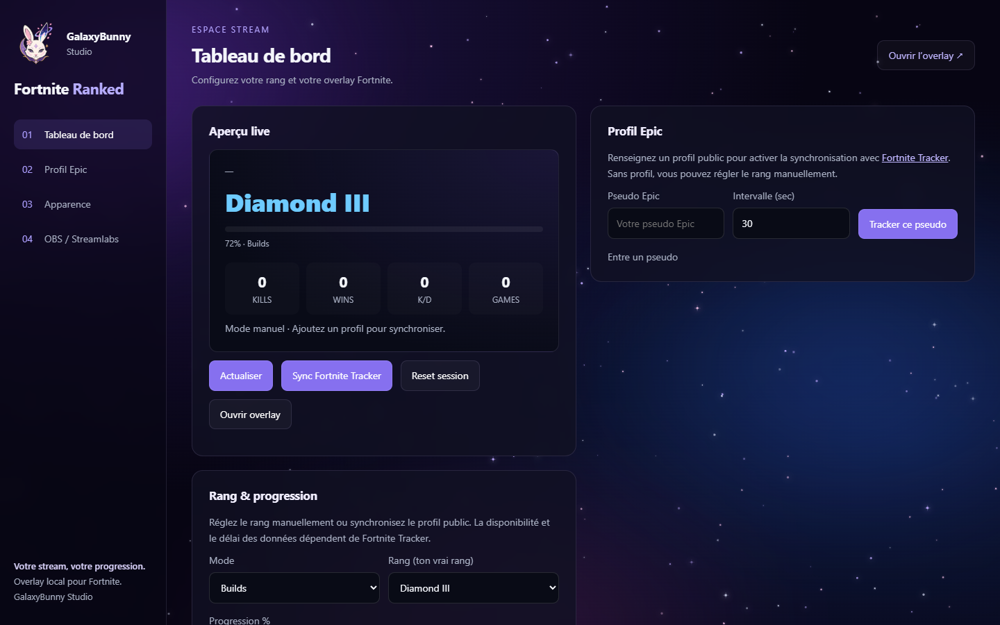
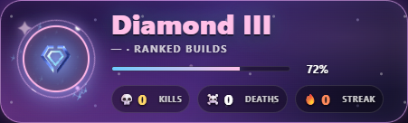
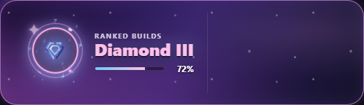

<p align="center">
  
</p>

<h1 align="center">Fortnite Ranked Overlay</h1>
<p align="center"><strong>GalaxyBunny Studio</strong> · fortnite-ranked-overlay</p>

<p align="center">
  Overlay local pour <strong>OBS</strong> et <strong>Streamlabs</strong> — rang, progression et session live.<br>
  Le simulateur de points ranked reste en ligne, dans toutes les langues.
</p>

<p align="center">
  <a href="https://hanacherry.github.io/fortnite-ranked-overlay/"></a>
  <a href="LICENSE"></a>
  <a href="package.json"></a>
</p>

<p align="center">
  <a href="README.md">Français</a> ·
  <a href="README.en.md">English</a> ·
  <a href="https://hanacherry.github.io/fortnite-ranked-overlay/?lang=es">Español</a> ·
  <a href="https://hanacherry.github.io/fortnite-ranked-overlay/?lang=pt">Português</a> ·
  <a href="https://hanacherry.github.io/fortnite-ranked-overlay/?lang=de">Deutsch</a> ·
  <a href="https://hanacherry.github.io/fortnite-ranked-overlay/?lang=it">Italiano</a> ·
  <a href="https://hanacherry.github.io/fortnite-ranked-overlay/?lang=ja">日本語</a> ·
  <a href="https://hanacherry.github.io/fortnite-ranked-overlay/?lang=ko">한국어</a> ·
  <a href="https://hanacherry.github.io/fortnite-ranked-overlay/?lang=zh">简体中文</a> ·
  <a href="https://hanacherry.github.io/fortnite-ranked-overlay/?lang=zh-TW">繁體中文</a> ·
  <a href="https://hanacherry.github.io/fortnite-ranked-overlay/?lang=ar">العربية</a> ·
  <a href="https://hanacherry.github.io/fortnite-ranked-overlay/?lang=ru">Русский</a> ·
  <a href="https://hanacherry.github.io/fortnite-ranked-overlay/?lang=hi">हिन्दी</a> ·
  <a href="https://hanacherry.github.io/fortnite-ranked-overlay/?lang=tr">Türkçe</a> ·
  <a href="https://hanacherry.github.io/fortnite-ranked-overlay/?lang=pl">Polski</a> ·
  <a href="https://hanacherry.github.io/fortnite-ranked-overlay/?lang=nl">Nederlands</a> ·
  <a href="https://hanacherry.github.io/fortnite-ranked-overlay/?lang=id">Bahasa Indonesia</a> ·
  <a href="https://hanacherry.github.io/fortnite-ranked-overlay/?lang=vi">Tiếng Việt</a> ·
  <a href="https://hanacherry.github.io/fortnite-ranked-overlay/?lang=th">ไทย</a> ·
  <a href="https://hanacherry.github.io/fortnite-ranked-overlay/?lang=uk">Українська</a> ·
  <a href="https://hanacherry.github.io/fortnite-ranked-overlay/?lang=sv">Svenska</a> ·
  <a href="https://hanacherry.github.io/fortnite-ranked-overlay/?lang=cs">Čeština</a> ·
  <a href="https://hanacherry.github.io/fortnite-ranked-overlay/?lang=ro">Română</a> ·
  <a href="https://hanacherry.github.io/fortnite-ranked-overlay/?lang=el">Ελληνικά</a> ·
  <a href="https://hanacherry.github.io/fortnite-ranked-overlay/?lang=hu">Magyar</a> ·
  <a href="https://hanacherry.github.io/fortnite-ranked-overlay/?lang=fi">Suomi</a> ·
  <a href="https://hanacherry.github.io/fortnite-ranked-overlay/?lang=da">Dansk</a> ·
  <a href="https://hanacherry.github.io/fortnite-ranked-overlay/?lang=no">Norsk</a> ·
  <a href="https://hanacherry.github.io/fortnite-ranked-overlay/?lang=he">עברית</a> ·
  <a href="https://hanacherry.github.io/fortnite-ranked-overlay/?lang=ca">Català</a> ·
  <a href="https://hanacherry.github.io/fortnite-ranked-overlay/?lang=ms">Bahasa Melayu</a> ·
  <a href="https://hanacherry.github.io/fortnite-ranked-overlay/?lang=tl">Filipino</a>
</p>

<p align="center">
  <a href="https://hanacherry.github.io/fortnite-ranked-overlay/">Site de présentation</a>
  ·
  <a href="https://hanacherry.github.io/fortnite-ranked-overlay/simulateur.html">Simulateur de points</a>
</p>

<p align="center">
  
</p>

## Du simulateur à l’overlay

Ce dépôt a commencé comme **calculateur de points ranked**. Il est désormais un **studio d’overlay** pour streamers : tableau de bord local, overlay OBS transparent, styles galactiques, synchronisation optionnelle d’un profil public Fortnite Tracker.

Le simulateur d’origine reste disponible [en ligne](https://hanacherry.github.io/fortnite-ranked-overlay/simulateur.html), gratuitement, dans 32 langues.

## Aperçu

<p align="center">
  
</p>

<p align="center">
  
  &nbsp;
  
</p>

## Fonctions

- **Rang & progression** — Bronze III → Unreal Legends, Builds ou Zero Build, à la main ou depuis un profil public
- **Overlay OBS / Streamlabs** — bannière, vue complète ou compacte, fond transparent
- **Session live** — kills, deaths, streak, toasts de rank up
- **Apparence** — 7 styles (Classique, Galaxy, Néon, Givre, Royal, Minimal, Galaxie astrale) et 6 finitions de badge
- **Privé par conception** — le serveur écoute uniquement `127.0.0.1` ; rien n’est envoyé vers un compte GalaxyBunny
- **Simulateur web** — estimation de points ranked sans installer Node.js

## Démarrage

Installez [Node.js 18+](https://nodejs.org), puis :

```sh
git clone https://github.com/HanaCherry/fortnite-ranked-overlay.git
cd fortnite-ranked-overlay
npm install
npm start
```

Ouvrez `http://127.0.0.1:8767`. L’application démarre **sans pseudo** : le mode manuel fonctionne tout de suite.

Sous Windows, `LANCER.bat` démarre aussi le serveur. `LANCER-SILENCIEUX.vbs` le lance sans console, après installation des dépendances.

Ajoutez votre propre pseudo Epic dans **Profil Epic** uniquement si vous voulez synchroniser un profil public.

## OBS / Streamlabs

1. Démarrez l’application et laissez-la ouverte pendant le stream.
2. Copiez l’URL de l’overlay dans l’onglet **OBS / Streamlabs**.
3. Ajoutez une source **Navigateur**.
4. Collez l’URL. Le fond est transparent par défaut.

Taille conseillée : **700 × 220** (bannière) · **1100 × 220** (vue complète).

| Page | Chemin |
|---|---|
| Tableau de bord | `/control.html` |
| Overlay | `/overlay.html` |
| Overlay compact | `/overlay-compact.html` |

## Synchronisation

La lecture du profil public utilise `playwright-core` et un navigateur Edge ou Chrome installé. Ce composant est installé automatiquement par les lanceurs Windows si nécessaire, ou par `npm install`. Une connexion Internet est nécessaire lors de la première installation. Les restrictions du site, les profils privés et les changements de format peuvent empêcher la synchronisation. Les données ne sont pas garanties en temps réel. L’intervalle par défaut est de 30 secondes.

## Données locales

`config.json` livré avec le projet est vide de tout compte. Les réglages saisis sont enregistrés séparément :

- `data/config.json` — pseudo et préférences locales
- `data/state.json` — statistiques et historique de session

Le dossier `data/` est créé automatiquement et **entièrement ignoré par Git**. N’ajoutez pas `data/` avec `git add -f`.

```sh
npm test
npm run export:github
```

Les tests vérifient le démarrage sans profil, la séparation des réglages locaux et le réglage du rang. L’export propre se trouve dans `dist/github/`.

## Identité

Logo : GalaxyBunny Studio. Fortnite et ses visuels de rang appartiennent à Epic Games et à leurs détenteurs respectifs. Ce projet est indépendant et n’est **pas** un produit officiel d’Epic Games.

## Conditions d’utilisation

L’application reste gratuite à utiliser, y compris pour les streams et vidéos monétisés. L’installation, la compilation locale, les sauvegardes et la configuration nécessaires à cet usage sont autorisées. Pour reprendre le nouveau code couvert dans un autre projet, le modifier, redistribuer l’application ou en vendre des copies, demandez l’accord écrit de HanaCherry via les issues du dépôt.

Ces conditions ne retirent aucun droit déjà accordé : le code précédemment publié sous MIT reste sous MIT et les composants d’autres auteurs conservent leurs licences. Les nouveaux apports originaux couverts suivent la [licence d’utilisation gratuite](LICENSE). Les droits de consultation et de fork prévus par GitHub sont préservés.
